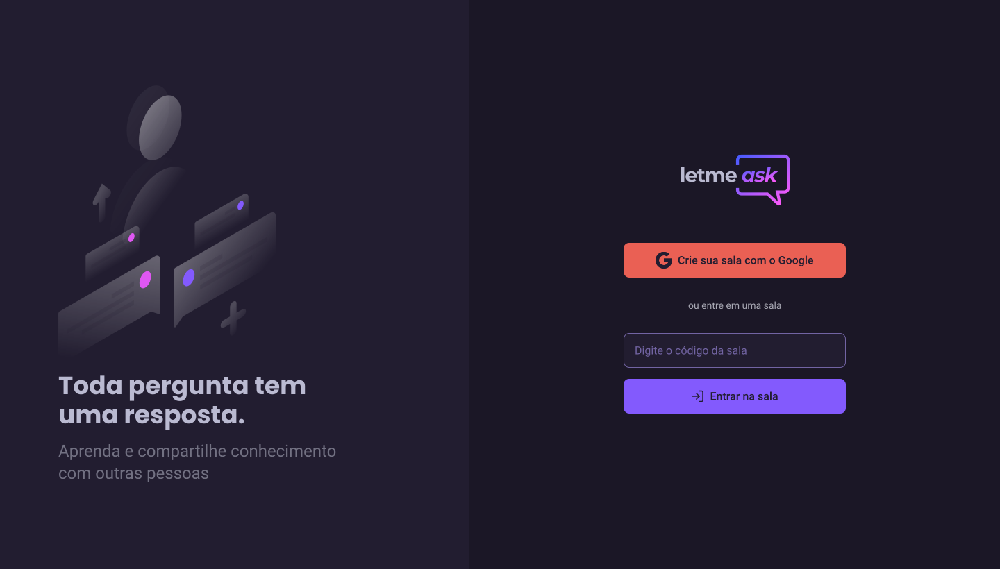

    

<h4 align='center'>
NLW#6 - together 🚀
</h4>

<h1 align="center">
    
</h1>

  <h2>Sobre 📘</h2>
  
Projeto desenvolvido durante o NLW#6 - Together -Trilha ReactJS by Rocketseat, onde tivemos a oportunidade de desenvolver a aplicação letmeASK, na qual podemos criar salas de Q&A ao vivo para tirar dúvidas em tempo real.

    <h2>Layout 🔖</h2>
    <h3>Autenticação com Google - Firebase</h3>
    
    
    <h3>Adicionar nova pergunta</h3>
    
    <h3>Marcar pergunta como destaque</h3>
    

  <h2>Tecnologias 🛠</h2>
  
As seguintes ferramentas foram usadas na construção do projeto:

  <ul>
    <li> <a href="https://pt-br.reactjs.org/">ReactJS</li>  
    <li> <a href="https://www.typescriptlang.org/">Typescript </li>  
    <li> <a href="https://firebase.google.com/?hl=pt">Firebase </li>  
    <li> <a href="https://reactrouter.com/">React Router DOM</li>  
    <li> <a href="https://sass-lang.com/">Sass</li>  

Feito com 💜 por
    <a href="https://github.com/glaubermatos">Glauber Matos</a> e
    <a href="https://github.com/Rocketseat">
      Rocketseat
    </a>
  

